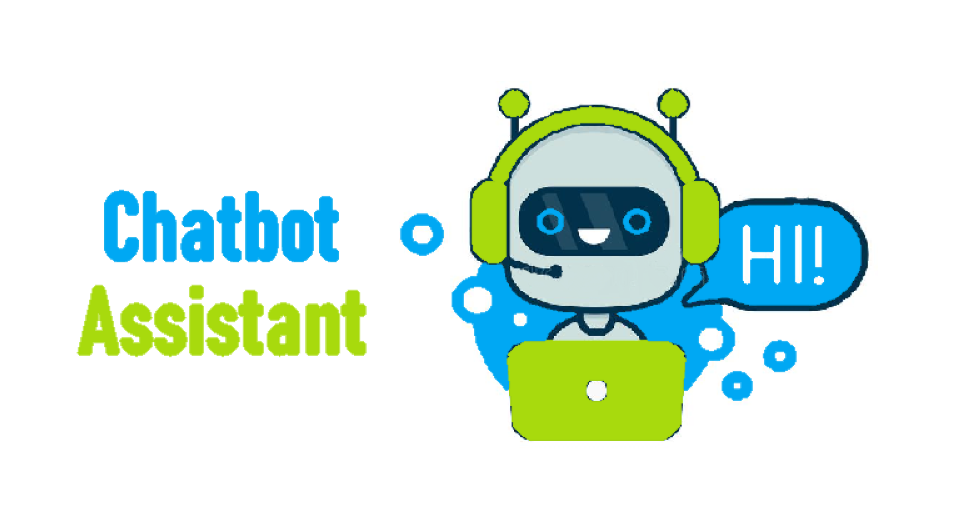

  

<h1 align="center">Systems Hacks 2021 Project</h1>

# 💰 **Business Values:**
- Increase customer conversion rate.
- Fast customer support available 24/7.
- Assist more customers with no additional cost.

# 📝 **Project Details:**
Systems Hacks is a hackathon for students who are interested to work in teams to work on projects that can have a real world impact.

## ❓ **Problem:**
Our current university website is convoluted and not user-friendly, so it is hard to navigate it espcially for new students.

## 💡 **Solution:**
Build a FAQ chatbot that can respond to user inquiries. To do this, we built and trained a model that can classify questions and answer them.

- ### 🛠️ Tools:
    * Machine Learning: Tensorflow
    * Data training: numpy
    * Language processing: nltk 
    * Data processing: JSON
    * Data serialization: pickle

- ### Models:
    * Combination of Natural Langauge Processing (NLP) and Neural Netoworks (NN).

- ## **Performance:**
    * The model has an accuracy of 0.9112 and a loss of 0.1485.

## 💡 **Contributions:**
1. **Kourosh:** natural language processing using nltk, refactoring code, and documentation
2. **Kaveh:** neural network using keras and tensorflow
3. **Iranges:** presentation, GUI setup
4. **Myckland:** presentation, report