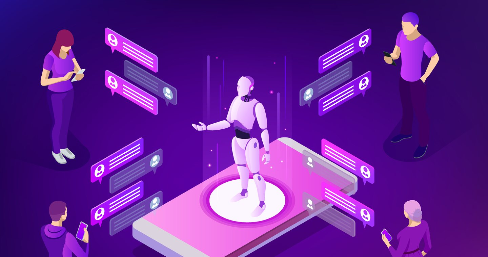

# Chatbot Assistant

  

<h4 align="center">Systems Hacks 2021</h4>
<h1 align="center">Awarded the most "advanced project".</h1>

## **About:**
Systems Hacks 2021 is a hackathon for students who are interested to work in teams to work on projects that can have a real world impact.

## **Problem:**
Our current university website is not user-friendly, so it is hard to navigate espcially for new students.

## **Solution:**
Trained a chatbot model that can classify questions and answer them.

- ### Tools:
    * Machine Learning: Tensorflow
    * Data training: numpy
    * Language processing: nltk 
    * Data processing: JSON
    * Data serialization: pickle

- ### Models:
    * Inegrated Natural Langauge Processing (NLP) and Neural Netoworks (NN).

## **Performance:**
- The model has an accuracy of 0.9112 and a loss of 0.1485.

## **Future Improvements:**
- Train on a larger dataset.
- Allow threaded discussion between the user and bot.
- Enhance graphical user interface.
